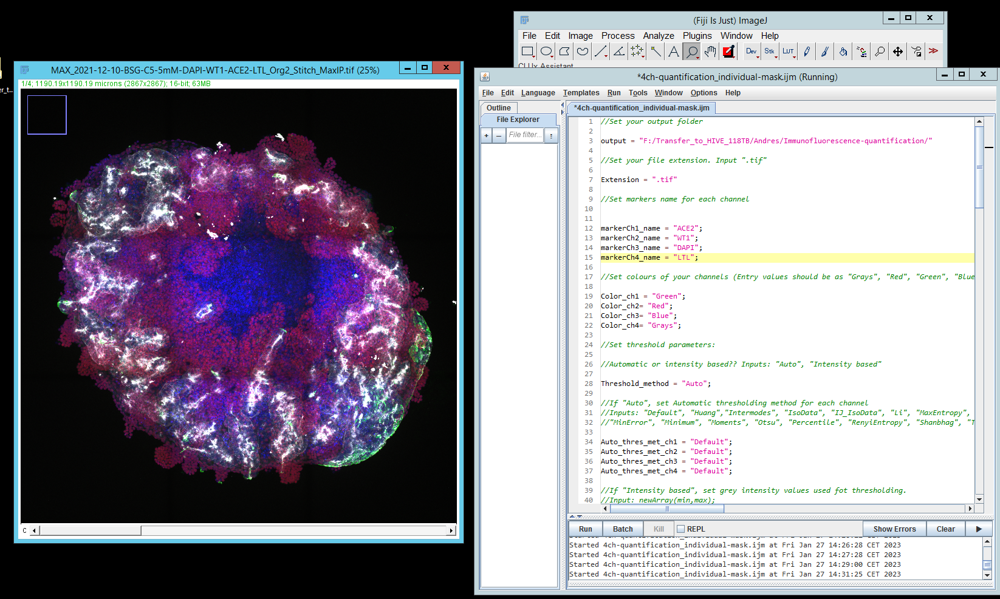
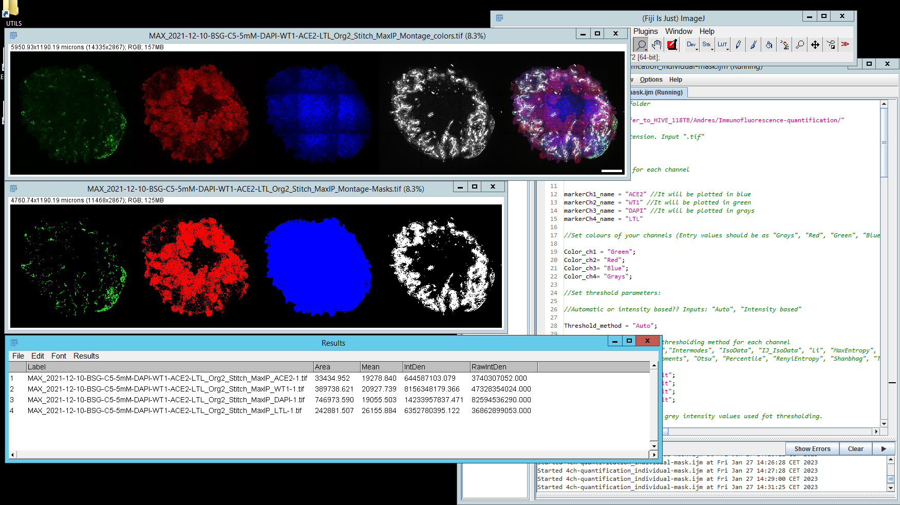
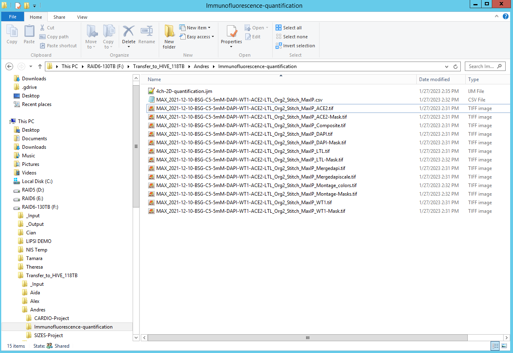

# Immunofluorescence 2D Quantification

Drag and drop your image and the macro _4ch-2D-quantification.ijm_ in Fiji-imagej. Then fill the macro in the macro interpreter by following instructions in green and press run.

After following macro instructions (pop-up windows),  the final output will be:

Resulting files will be stored in the output path (output folder) that you introduced in the macro interpreter:

